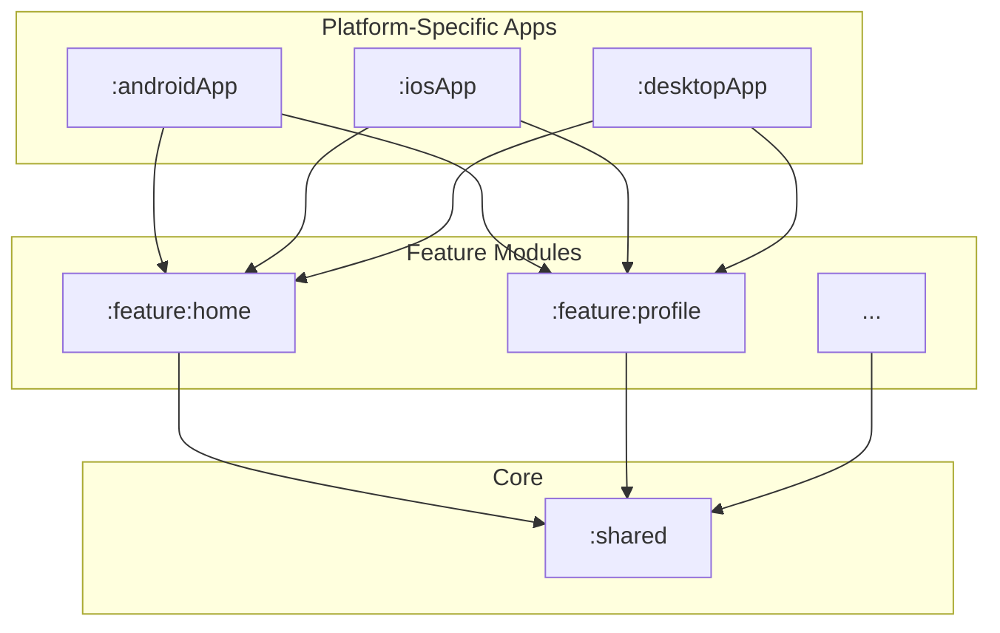
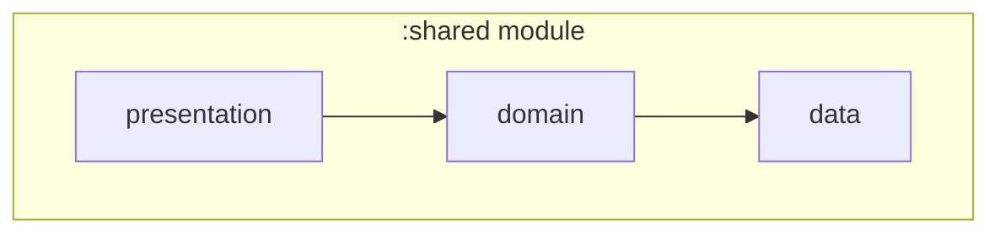
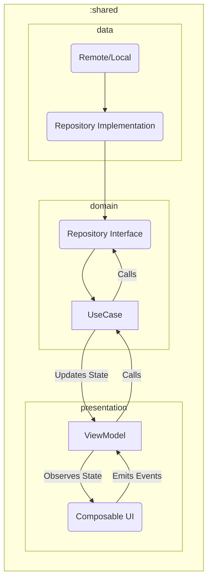
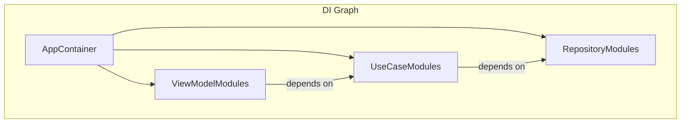

# Architecture Guide

This document outlines the architecture of this Compose Multiplatform project. The goal is to maintain a scalable, maintainable, and testable codebase.

The architecture is based on a multi-module approach, with a clear separation of concerns inspired by Clean Architecture principles.

## 1. High-Level Module Structure

The project is divided into several modules. The main modules are the platform-specific application modules (`:androidApp`, `:iosApp`, etc.) and a `:shared` module containing the common business logic and UI.

-   **`:platformApp` (e.g., `:androidApp`, `:iosApp`)**: These modules contain the platform-specific entry points and configurations. They depend on feature modules to build the final application.
-   **`:feature:*`**: Each feature of the application is encapsulated in its own module. This improves build times and promotes code ownership and separation. Feature modules depend on the `:shared` module.
-   **`:shared`**: This is a Kotlin Multiplatform module that contains all the shared code, including business logic, data handling, and shared UI components.

## 2. Shared Module Architecture

The `:shared` module is the core of the application. It follows a layered architecture to separate concerns.

-   **`presentation`**: This layer contains the ViewModels (or Presenters) and shared UI components (Composables). It is responsible for observing state from the `domain` layer and translating it into a UI that the user can interact with. It knows nothing about the `data` layer.
-   **`domain`**: This is the core business logic layer. It contains use cases, business models, and repository interfaces. It is a pure Kotlin module with no dependencies on the `presentation` or `data` layers.
-   **`data`**: This layer is responsible for fetching data. It contains implementations of the repository interfaces defined in the `domain` layer. It handles data from various sources like network APIs and local databases.

## 3. Data Flow

The data flow is unidirectional, which makes the application state predictable and easier to debug.

1.  **UI Event**: The user interacts with the UI (e.g., clicks a button).
2.  **ViewModel**: The UI sends an event to the ViewModel.
3.  **Use Case**: The ViewModel calls a Use Case from the `domain` layer to execute a business action.
4.  **Repository**: The Use Case interacts with a Repository (via its interface) to get or save data.
5.  **Data Source**: The Repository implementation in the `data` layer fetches data from a remote or local data source.
6.  **State Update**: The Use Case returns data to the ViewModel, which updates its state.
7.  **UI Update**: The UI, observing the ViewModel's state, automatically recomposes to reflect the new state.

## 4. Dependency Injection

We use a dependency injection framework (like Koin or Kodein) to manage dependencies across the application. Dependencies are defined in the `:shared` module and can be injected into both shared code and platform-specific code.

-   Dependencies are declared in modules within the `:shared` module.
-   The application entry point on each platform is responsible for initializing the DI container.
-   This allows for easy swapping of implementations for testing (e.g., providing a fake repository).

