# 🧭 Mermaid Diagram Guide

Mermaid diagrams let you create flowcharts, architecture maps, sequence diagrams, and more — using only **plain text** inside Markdown. They are lightweight, fast to write, and perfect for documentation (GitHub, Notion, Docusaurus, etc.).

---

## 1. Basic Structure

A Mermaid diagram starts with **triple backticks** (```) and the language tag `mermaid`:

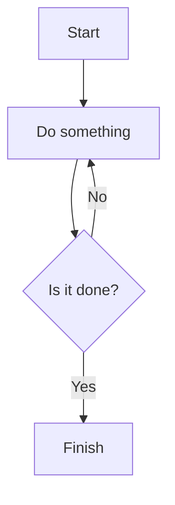

---

## 2. Graph Directions

After `graph`, specify the flow direction:

| Direction | Meaning |
|------------|----------|
| `TD` | Top → Down (default) |
| `BT` | Bottom → Top |
| `LR` | Left → Right |
| `RL` | Right → Left |

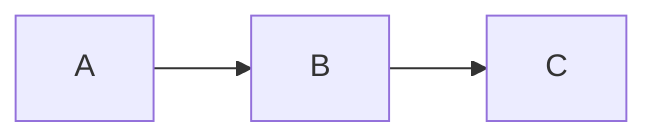

---

## 3. Node Shapes

| Shape | Syntax | Example |
|--------|---------|----------|
| Rectangle | `A[Text]` | `A[Task]` |
| Rounded rectangle | `A(Text)` | `A(Start)` |
| Circle | `A((Circle))` | `A((Node))` |
| Diamond (Decision) | `A{Yes or No?}` | `A{Check}` |
| Asymmetrical | `A>This is weird<` | `A>Alt<` |

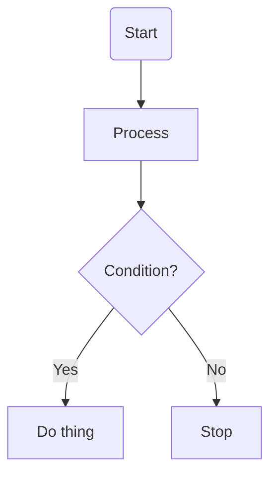

---

## 4. Arrows and Links

| Arrow | Meaning |
|--------|----------|
| `-->` | Standard arrow |
| `---` | Line without arrow |
| `-.->` | Dotted arrow |
| `==>` | Thick arrow |
| `-->|"Text"|` | Arrow with label |

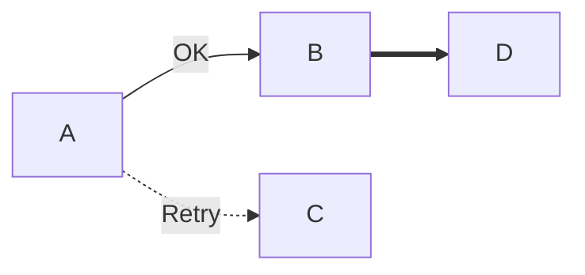

---

## 5. Subgraphs (Grouping)

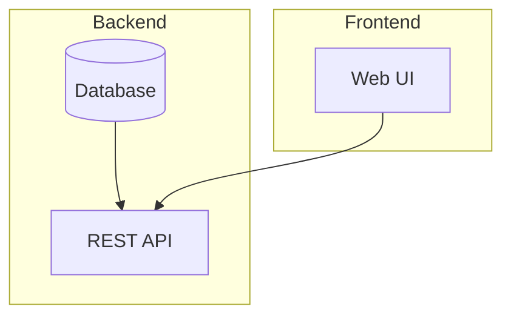

---

## 6. Common Diagram Types

### 🪜 Sequence Diagram
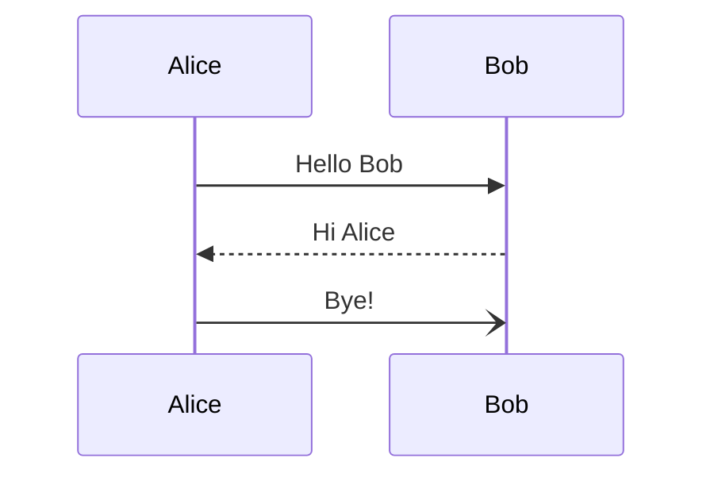

### 🏗️ Class Diagram
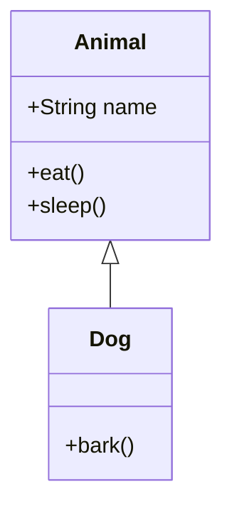

### 🧱 State Diagram
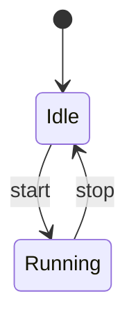

### 🧠 ER Diagram
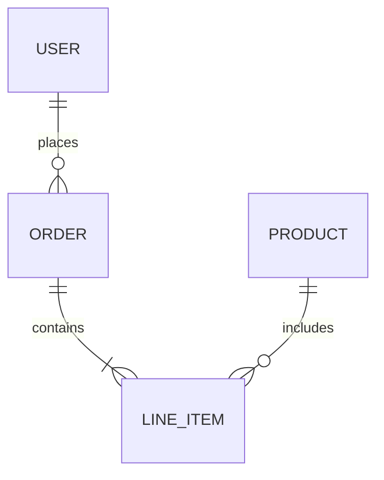

---

## 7. Tips

✅ Use descriptive node IDs  
✅ Indent for hierarchy  
✅ Use subgraphs for grouping

---

## 8. Example: Clean Architecture

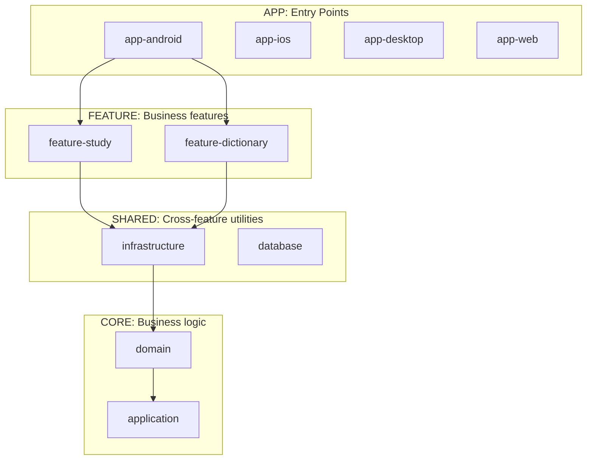

---

## 9. Rendering Mermaid

You can preview Mermaid diagrams in:
- **GitHub Markdown**
- **VS Code** with “Markdown Preview Mermaid Support”
- **Obsidian**, **Notion**, **Docusaurus**, **MkDocs**
- [Mermaid Live Editor](https://mermaid.live)

# Mermaid Diagrams Guide

## What is Mermaid?

Mermaid is a text-based diagramming tool that creates diagrams from markdown-like syntax. It's supported in GitHub, GitLab, Notion, and many documentation platforms.

## Basic Syntax

Wrap your Mermaid code in a fenced code block with `mermaid` as the language:

```
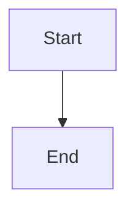
```

## 1. Flowcharts

### Basic Example
```
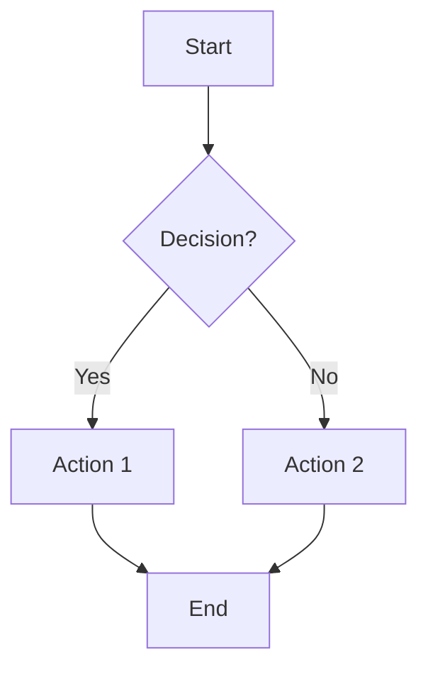
```

### Direction Options
- `graph TD` or `graph TB` - Top to bottom
- `graph LR` - Left to right
- `graph RL` - Right to left
- `graph BT` - Bottom to top

### Node Shapes
- `A[Rectangle]` - Rectangle
- `B(Rounded)` - Rounded edges
- `C([Stadium])` - Stadium shape
- `D[[Subroutine]]` - Subroutine
- `E[(Database)]` - Database
- `F((Circle))` - Circle
- `G{Diamond}` - Diamond (decision)
- `H{{Hexagon}}` - Hexagon

### Arrow Types
- `-->` - Arrow
- `---` - Plain line
- `-.->` - Dotted arrow
- `==>` - Thick arrow
- `-->|Text|` - Arrow with label

## 2. Sequence Diagrams

Show interactions between objects over time.

```
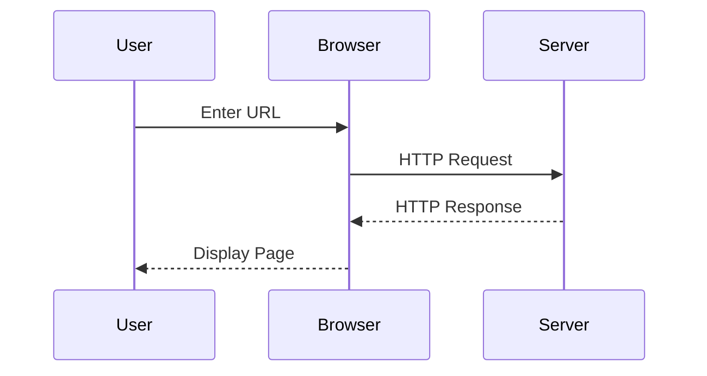
```

### Advanced Features
- `->>` - Solid arrow
- `-->>` - Dotted arrow
- `--)` - Async arrow
- `+` and `-` for activation/deactivation
- `Note right/left of Actor: Text` for notes
- `loop`, `alt`, `opt` for control flow

## 3. Class Diagrams

Show object-oriented class relationships.

```
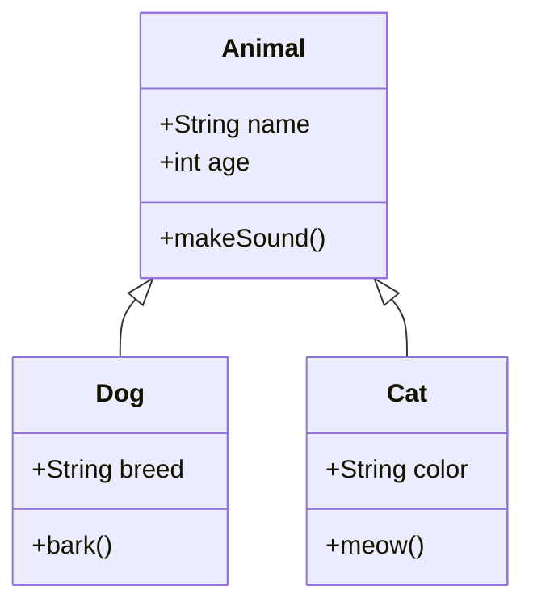
```

### Relationship Types
- `<|--` - Inheritance
- `*--` - Composition
- `o--` - Aggregation
- `-->` - Association
- `--` - Link (solid)
- `..>` - Dependency
- `..|>` - Realization

## 4. State Diagrams

Show state transitions.

```
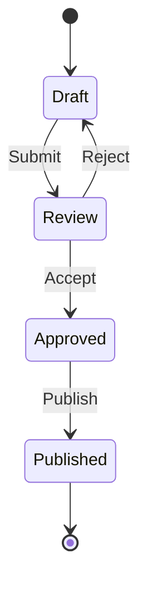
```

## 5. Entity Relationship Diagrams (ERD)

Show database relationships.

```
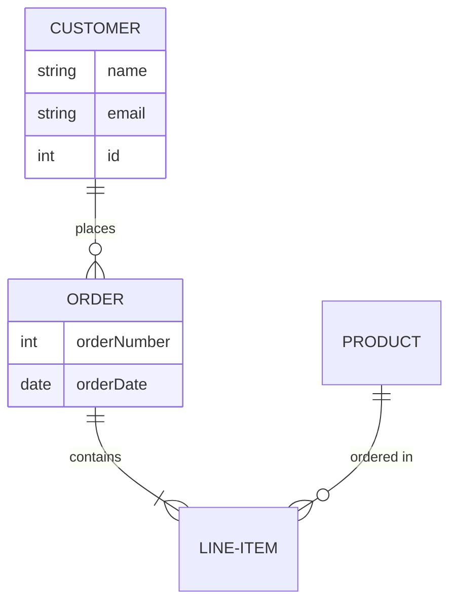
```

### Relationship Types
- `||--||` - One to one
- `||--o{` - One to many
- `}o--o{` - Many to many
- `||--|{` - One to one or many

## 6. Gantt Charts

Show project schedules.

```
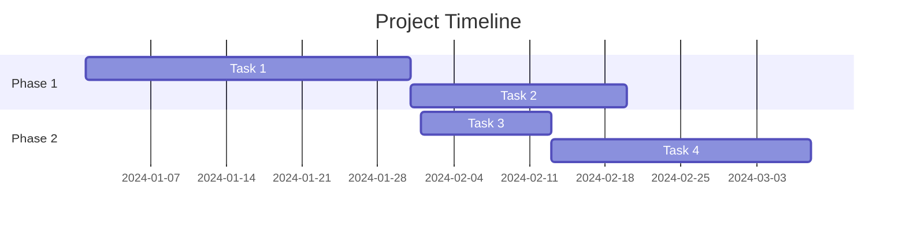
```

## 7. Pie Charts

```
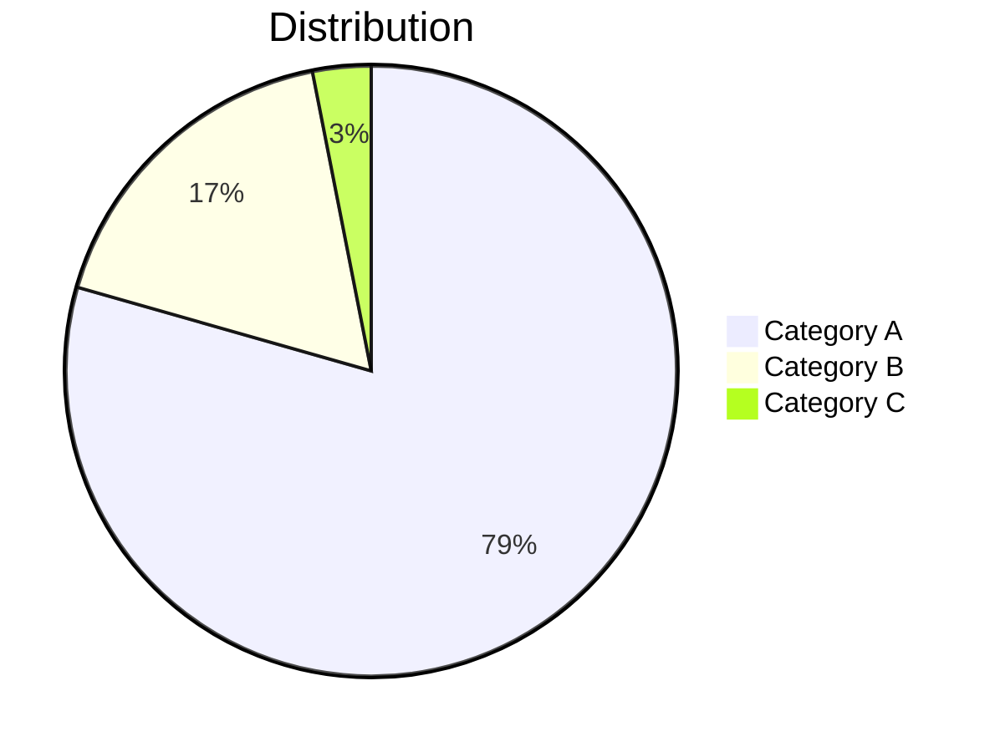
```

## 8. Git Graphs

Show git branch history.

```
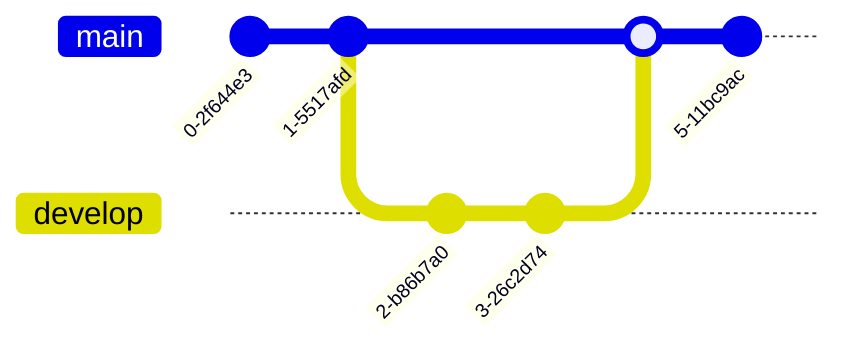
```

## 9. User Journey

```
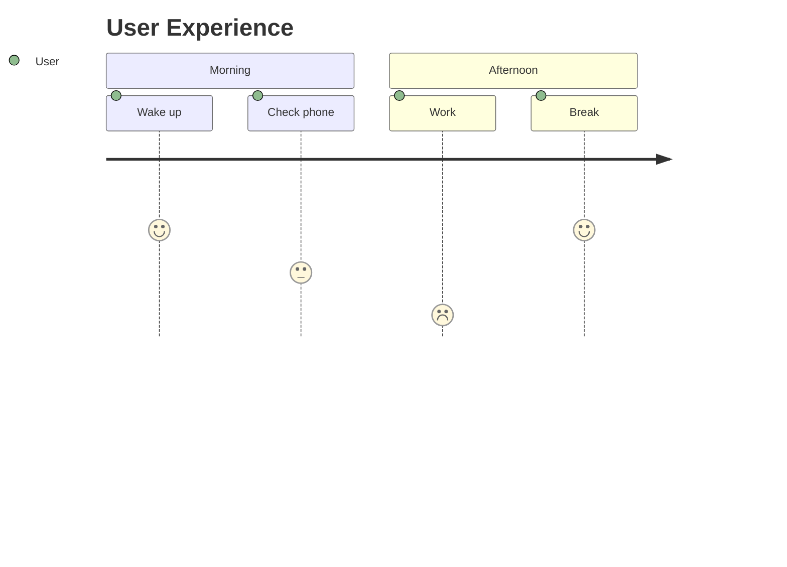
```

## Tips and Best Practices

1. **Keep it simple** - Don't overcrowd diagrams
2. **Use meaningful labels** - Make node names descriptive
3. **Test your syntax** - Use the Mermaid Live Editor (https://mermaid.live)
4. **Add comments** - Use `%%` for comments
5. **Consistent styling** - Stick to one direction/style per diagram

## Styling (Optional)

Customize colors and styles:

```
```mermaid
graph LR
    A[Start]:::customStyle --> B[End]
    classDef customStyle fill:#f96,stroke:#333,stroke-width:2px
```
```

## Common Issues

- **Syntax errors** - Check for typos in keywords and arrows
- **Missing spaces** - Ensure proper spacing around arrows
- **Unsupported features** - Some platforms use different Mermaid versions
- **Indentation** - Keep consistent indentation for readability

## Resources

- Official Documentation: https://mermaid.js.org/
- Live Editor: https://mermaid.live
- GitHub Support: Works natively in GitHub markdown

---

Happy diagramming!
