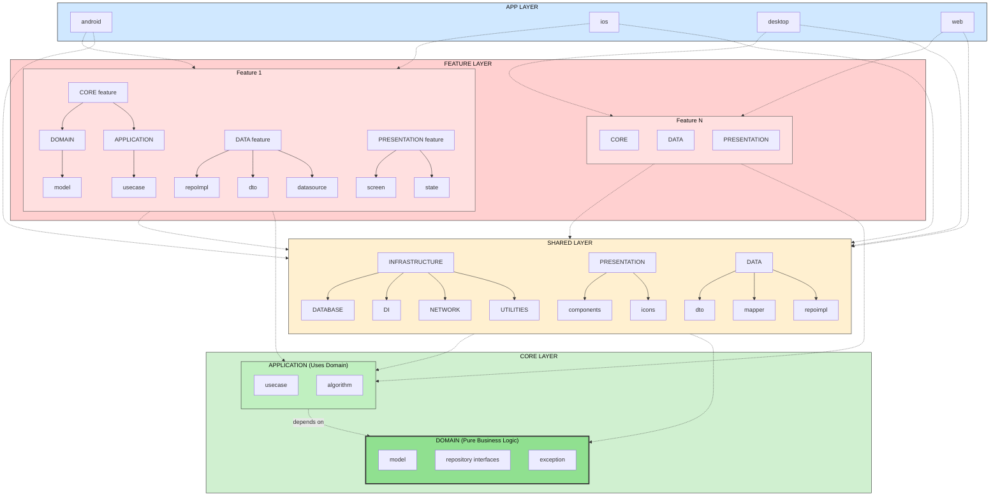

# Architecture Overview

```mermaid
graph TD
%% === Top-Level Modules ===
    subgraph APP["APP LAYER"]
        direction TB
        A1[android]
        A2[ios]
        A3[desktop]
        A4[web]
    end

    subgraph CORE["CORE LAYER"]
        direction TB

        subgraph B1["DOMAIN (Pure Business Logic)"]
            direction TB
            B1_1[model]
            B1_2[repository interfaces]
            B1_3[exception]
        end

        subgraph B2["APPLICATION (Uses Domain)"]
            direction TB
            B2_1[usecase]
            B2_2[algorithm]
        end

        B2 -.->|depends on| B1
    end

    subgraph SHARED["SHARED LAYER"]
        direction TB
        C1[INFRASTRUCTURE]
        C2[PRESENTATION]
        C3[DATA]

        C1 --> C1_1[DATABASE]
        C1 --> C1_2[DI]
        C1 --> C1_3[NETWORK]
        C1 --> C1_4[UTILITIES]

        C2 --> C2_1[components]
        C2 --> C2_2[icons]

        C3 --> C3_1[dto]
        C3 --> C3_2[mapper]
        C3 --> C3_3[repoimpl]
    end

    subgraph FEATURE["FEATURE LAYER"]
        direction TB

        subgraph FEATURE_1["Feature 1"]
            direction TB
            F1_CORE[CORE feature]
            F1_DATA[DATA feature]
            F1_PRES[PRESENTATION feature]

            F1_CORE --> F1_C_DOM[DOMAIN]
            F1_C_DOM --> F1_C_DOM_M[model]
            F1_CORE --> F1_C_APP[APPLICATION]
            F1_C_APP --> F1_C_APP_U[usecase]

            F1_DATA --> F1_D_R[repoImpl]
            F1_DATA --> F1_D_D[dto]
            F1_DATA --> F1_D_DS[datasource]

            F1_PRES --> F1_P_S[screen]
            F1_PRES --> F1_P_ST[state]
        end

        subgraph FEATURE_N["Feature N"]
            direction TB
            FN_CORE[CORE]
            FN_DATA[DATA]
            FN_PRES[PRESENTATION]
        end
    end

%% === High-Level Dependencies ===
    A1 -.-> FEATURE_1
    A2 -.-> FEATURE_1
    A3 -.-> FEATURE_N
    A4 -.-> FEATURE_N

    A1 -.-> SHARED
    A2 -.-> SHARED
    A3 -.-> SHARED
    A4 -.-> SHARED

    FEATURE_1 -.-> SHARED
    FEATURE_N -.-> SHARED

    FEATURE_1 -.-> B2
    FEATURE_N -.-> B2

    SHARED -.-> B2
    SHARED -.-> B1

%% === Styling ===
    style APP fill:#D0E8FF,stroke:#0C0C0C,color:#0A0A0A
    style CORE fill:#D0F0D0,stroke:#333,color:#0A0A0A
    style B1 fill:#90E090,stroke:#333,stroke-width:3px,color:#0A0A0A
    style B2 fill:#C0F0C0,stroke:#333,color:#0A0A0A
    style SHARED fill:#FFF0D0,stroke:#333,color:#0A0A0A
    style FEATURE fill:#FFD0D0,stroke:#333,color:#0A0A0A

    style FEATURE_1 fill:#FFE0E0,stroke:#555,color:#0A0A0A
    style FEATURE_N fill:#FFE0E0,stroke:#555,color:#0A0A0A
```
