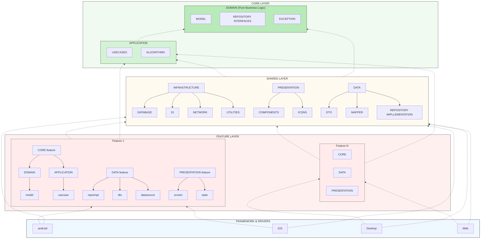
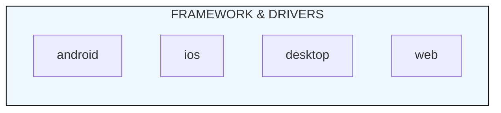
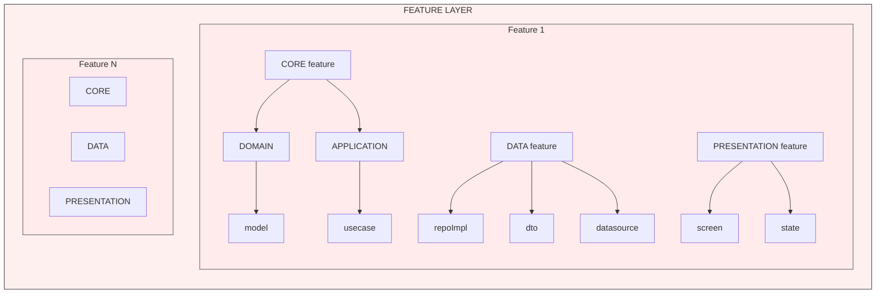
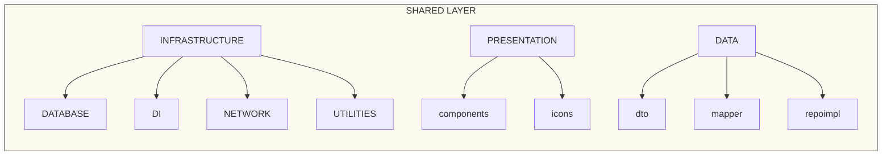
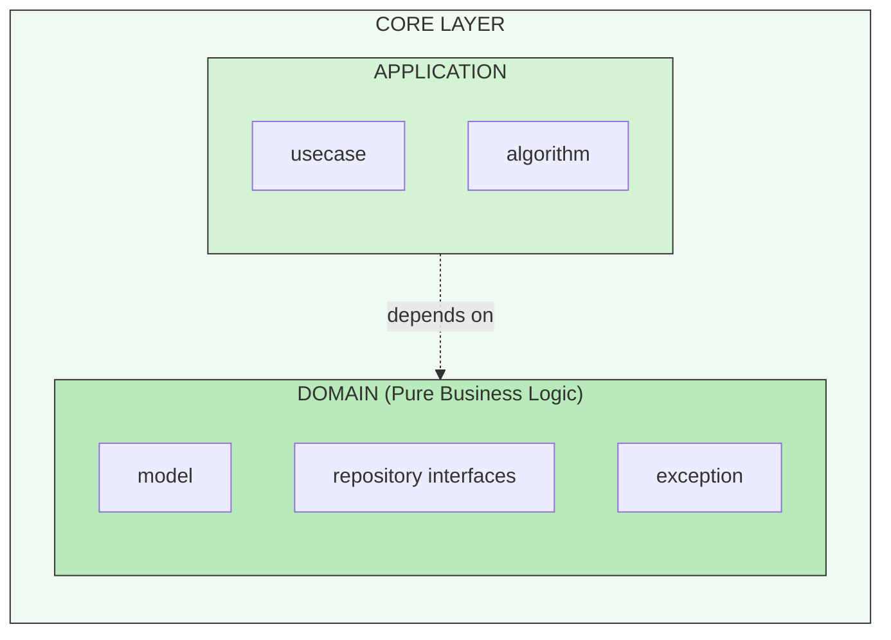
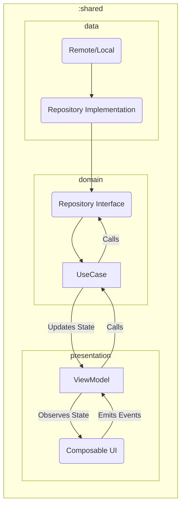
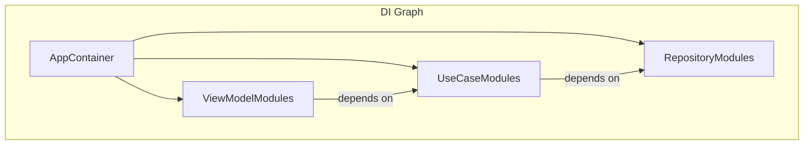

# Architecture Overview

This document provides a comprehensive overview of the project's architecture. The architecture is designed to be modular, scalable, and maintainable, promoting a clear separation of concerns through a multi-module setup.
The multi-module architecture is inspired by Clean Architecture principles, ensuring that each module has a specific responsibility and can be developed, tested, and maintained independently.
Another major bonus of this architecture is the improved build times, as changes in one module do not necessitate rebuilding the entire codebase.

## High-Level Diagram

## Architectural Layers

The architecture is divided into four main layers, each with a distinct responsibility. The dependencies flow inwards, from the platform-specific code towards the core business logic.

1.  **Framework & Drivers Layer**: The outermost layer, containing platform-specific implementations.
2.  **Feature Layer**: Contains individual, self-contained feature modules.
3.  **Shared Layer**: Provides common utilities and infrastructure for all features.
4.  **Core Layer**: Encapsulates the core business logic of the application.

---

### 1. Framework & Drivers Layer

This layer represents the entry points for each target platform (Android, iOS, Desktop, Web).

-   **Responsibilities**:
    -   Initialize the application.
    -   Set up platform-specific configurations.
    -   Compose the UI by assembling screens from various feature modules.
    -   Provide platform-specific implementations for APIs defined in lower layers (if any).
-   **Dependencies**: This layer depends on the **Feature Layer** to display screens and the **Shared Layer** for common infrastructure like Dependency Injection setup.

---

### 2. Feature Layer

This layer encapsulates the individual features of the application. Each feature is a self-contained module or group of modules, promoting high cohesion and low coupling between features.

-   **Structure**: Each feature is broken down into three sub-modules:
    -   `PRESENTATION`: Contains the UI (screens, states) for the feature.
    -   `DATA`: Implements data handling logic, including repository implementations, DTOs, and data sources specific to the feature.
    -   `CORE`: Contains the feature's business logic (domain models, use cases). This can be seen as a feature-specific slice of the main Core Layer.
-   **Dependencies**: Feature modules depend on the **Shared Layer** for common components and the **Core Layer** for application-wide business rules and models.

---

### 3. Shared Layer

The Shared Layer contains code that is common across multiple features and platforms. This promotes reusability and consistency.

-   **Components**:
    -   `INFRASTRUCTURE`: Cross-cutting concerns like networking clients, database drivers, dependency injection setup, and general utilities.
    -   `PRESENTATION`: Reusable UI components (e.g., buttons, text fields) and shared icons/themes.
    -   `DATA`: Common data transfer objects (DTOs), mappers, and base repository implementations that can be shared across features.
-   **Dependencies**: This layer depends on the **Core Layer** to understand the business models it needs to support.

---

### 4. Core Layer

This is the heart of the application, containing all the core business logic. It is completely independent of any UI, framework, or database, making it highly portable and testable.

-   **Sub-layers**:
    -   `DOMAIN`: The innermost part, containing pure business logic. It defines the business `models`, `repository interfaces`, and custom `exceptions`. It has no external dependencies.
    -   `APPLICATION`: Orchestrates the data flow to and from the `DOMAIN`. It contains `use cases` that encapsulate specific business operations and complex `algorithms`.
-   **Dependencies**: The `APPLICATION` sub-layer depends on the `DOMAIN` sub-layer. The Core Layer as a whole has no dependencies on any other layer, enforcing the "Dependency Rule" of Clean Architecture.

## Data Flow

The data flow is unidirectional, which, in theory, should make the application state predictable and easier to debug.

1.  **UI Event**: The user interacts with the UI (e.g., clicks a button).
2.  **ViewModel**: The UI sends an event to the ViewModel.
3.  **Use Case**: The ViewModel calls a Use Case from the `domain` layer to execute a business action.
4.  **Repository**: The Use Case interacts with a Repository (via its interface) to get or save data.
5.  **Data Source**: The Repository implementation in the `data` layer fetches data from a remote or local data source.
6.  **State Update**: The Use Case returns data to the ViewModel, which updates its state.
7.  **UI Update**: The UI, observing the ViewModel's state, automatically recomposes to reflect the new state.

## Dependency direction and how to inject it

We use a dependency injection framework (Koin) to manage dependencies across the application. Dependencies are defined in the `:shared` module and can be injected into both shared code and platform-specific code.

-   Dependencies are declared in modules within the `:shared` module.
-   The application entry point on each platform is responsible for initializing the DI container.
-   This allows for easy swapping of implementations for testing (e.g., providing a fake repository).
